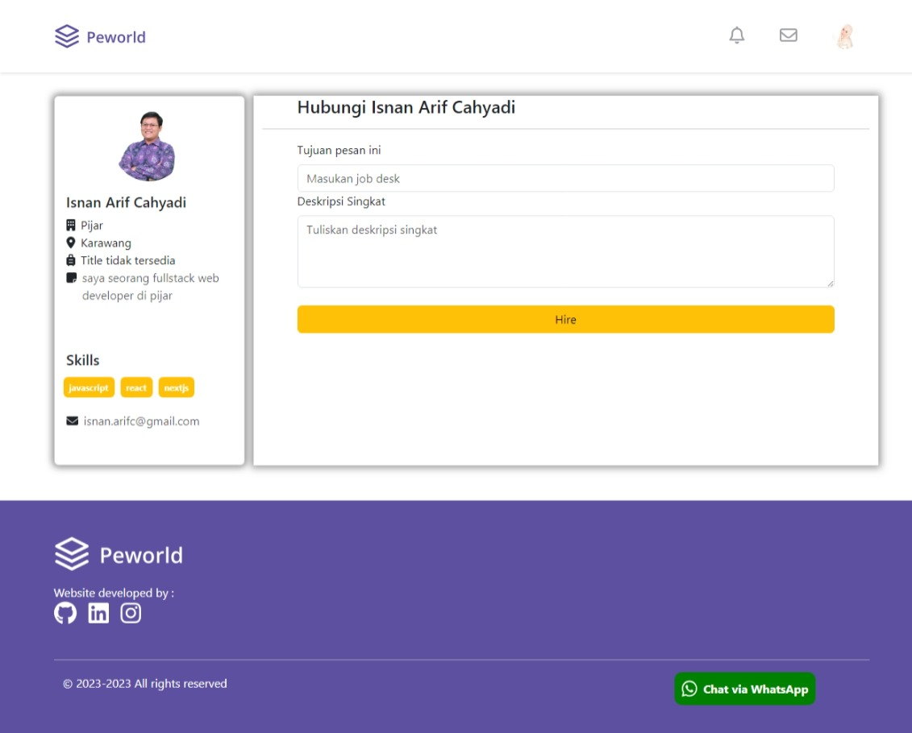

<h3 align="center">Peworld</h3>
<p align="center">
  <a href="https://hire-job-v1-rizki-suprayogo.vercel.app/">View Demo</a>
</p>

<!-- ABOUT THE PROJECT -->
## About The Project

Peworld is a web-based application build for recruitment process. The application design an attractive and user-friendly interface to help companies find and recruit suitable employees that match their requirements.

### Technology Used
- [NextJS](https://nextjs.org/)
- [Redux](https://redux.js.org/)
- [Bootstrap](https://getbootstrap.com/)
- [Axios](https://github.com/axios/axios)


This is a [Next.js](https://nextjs.org/) project bootstrapped with [`create-next-app`](https://github.com/vercel/next.js/tree/canary/packages/create-next-app).

## Getting Started

- Clone This Repository

`https://github.com/suprayogo/hire-job-v1.git`


- Install Module

`npm install`

- run the development server

```bash
npm run dev
# or
yarn dev
# or
pnpm dev
```

- Setting .env

```bash
NEXT_PUBLIC_BASE_URL=YOUR_API_URL
```


Open [http://localhost:3000](http://localhost:3000) with your browser to see the result.

You can start editing the page by modifying `pages/index.js`. The page auto-updates as you edit the file.

[API routes](https://nextjs.org/docs/api-routes/introduction) can be accessed on [http://localhost:3000/api/hello](http://localhost:3000/api/hello). This endpoint can be edited in `pages/api/hello.js`.

The `pages/api` directory is mapped to `/api/*`. Files in this directory are treated as [API routes](https://nextjs.org/docs/api-routes/introduction) instead of React pages.

This project uses [`next/font`](https://nextjs.org/docs/basic-features/font-optimization) to automatically optimize and load Inter, a custom Google Font.


### Executing program

- Run this project with `npm run dev`.


<!-- SCREENSHOT -->
## Screenshot
<hr>

### Login


### Register


### Landing


### Profile


### Edit Profile


### Job List


### Hiring


<!-- RELATED PROJECT -->
## Related Project

- [Peworld API](https://github.com/suprayogo/hire_job_be)
- [Peworld Demo](https://hire-job-v1-rizki-suprayogo.vercel.app/)

<!-- CONTACT INFO -->
## Contact Info

Contributors names and contact info:

1. Rizki Suprayogo

- [Linkedin](https://www.linkedin.com/in/rizki-suprayogo/)

